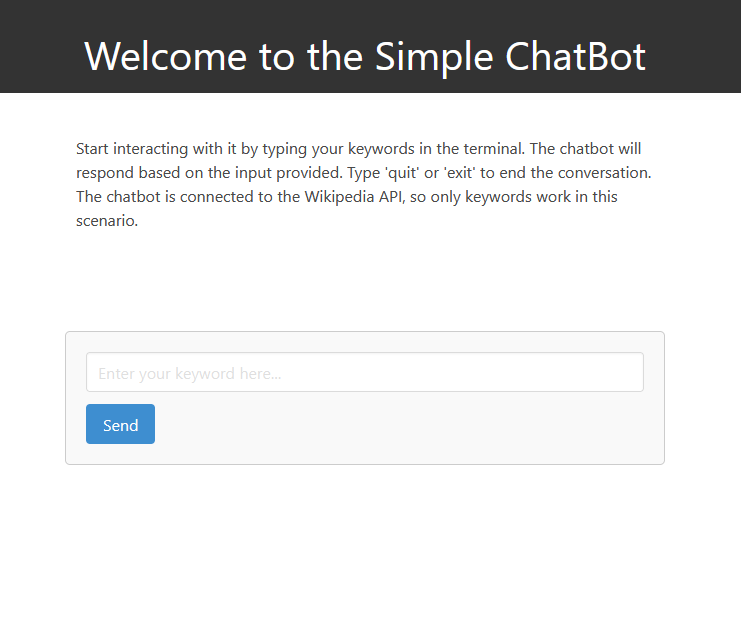

# Simple ChatBot

## :newspaper: About the project

A minimalistic ChatBot implemented in Python that can retrieve information from Wikipedia based on keywords provided by a user.

### How it works

The chatbot operates by first receiving user input through a text input field in a web interface. Upon receiving the input, it normalizes the text by converting it to lowercase and removing punctuation.

The normalized input is then checked against a conversation history to see if there's a pre-existing response. If not found, the chatbot queries the Wikipedia API to fetch relevant information based on the input.

This information is then cached for future use. The bot responds to the user with the fetched data or a default message if no relevant information is found. The conversation history, consisting of user inputs and bot responses, is stored in a file for reference. Additionally, the chat interface displays the conversation history, with user and bot messages displayed in separate chat bubbles.

The chatbot continuously interacts with users in this manner, dynamically fetching information and updating the conversation history as needed.

### Content overview

    .
    ├── img/ - images for the README.md
    ├── static/ - contains stylesheets
    ├── templates/ - contains the html templates
    ├── tests/ - contains unit tests
    ├── chatbot.py - program entry point
    ├── LICENSE - license text
    └── README.md - relevant information about the project

## :runner: Getting started

### Prerequisites and example usage

1. Clone the project and extract the folder:

```bash
git clone https://github.com/CH6832/chatbot.git
```

2. Open the entire project in an IDE of your choice.

3. Run the app:

```bash
python3 chatbot.py
```

4. the open the link in your browser and start interacting with it:



## :books: Resources used to create this project

* Python
  * [Python 3.11 documentation](https://docs.python.org/3.11/)
  * [Built-in Functions](https://docs.python.org/3.11/library/functions.html)
  * [Python Module Index](https://docs.python.org/3.11/py-modindex.html)
  * [Flask](https://flask.palletsprojects.com/en/3.0.x/)
* Wikipedia API
  * [Getting started with Wikimedia APIs](https://api.wikimedia.org/wiki/Getting_started_with_Wikimedia_APIs)
* Editor
  * [Visual Studio Code](https://code.visualstudio.com/)

## :bookmark: License

This project is licensed under the terms of the [MIT License](LICENSE).
